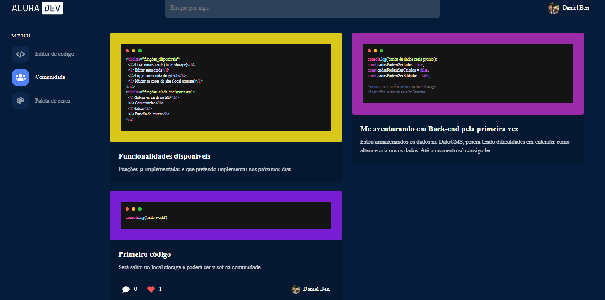

# Alura Challenge Front-end - Code Editor (Vanilla Javascript)

#alurachallengefront2

Read this in [portuguese](./README.md)

** I'm remaking this code using React and Nextjs in [this new repository](https://github.com/daniel-ben/code-editor) **

Website made during a Code Challenge called Alura Challenge Front-end from Alura. The challenge has the goal of simulating a real job situation where the student must create a website following a client request.

It was given a base template on [figma](https://www.figma.com/file/Ve4hpTfmMa7yAFneoGtGKD/Alura-Challenge---Edição-Front-end?node-id=207%3A1446) and Trello cards to orient the students. 

## Website on it's natural environment
[Code editor](https://daniel-ben.github.io/alura-challenge-2/)

## Summary

- [Objectives](https://github.com/daniel-ben/alura-challenge-2#objectives)
- [How to use it](https://github.com/daniel-ben/alura-challenge-2#how-to-use-it)
- [Screenshots](https://github.com/daniel-ben/alura-challenge-2#screenshots)
- [Built with](https://github.com/daniel-ben/alura-challenge-2#built-with)
- [Journey](https://github.com/daniel-ben/alura-challenge-2#journey)
- [Soon...](https://github.com/daniel-ben/alura-challenge-2#soon)

## Objectives

- Create a website from start based on a given template
- Use any tools you want to make it
- Visualize codes with highlight
- Save codes in png, jpeg or svg extensions
- Visualize saved codes on community page
- Editable codes after saved
- Use some database to make codes remain
- Style page to change website style

## How to use it
- You can login with your github username (github.com/**your-username**)
- If you don't have a github account, just click *entrar sem login* under the login button
- On code editor page, you can paste your codes and check them with highlight clicking *Visuazliar com o highlight* button
- If you want to save your project, just fill in the requested fields and click *Salvar projeto* button
- To visualize your saved projects, just click *comunidade*
- If you want to edit a saved project, you can click it and you will be redirected to the editor
- You can change the website colors at *paleta de cores* page. The changes will be stored on local storage

## Screenshots

## Built with
- HTML
- CSS
- BEM (Block, Element, Modifier)
- Javascript
- Flexbox 
- Grid Layout
- DatoCMS (BD)

## Journey
This was my first time making a website from scratch. I learned:

- How to use libraries like:
  - Highlight JS
- Fetch data from a BD like DatoCMS
- Save data to local and session storage
- File structure (and how hard it is to organize as the project grows)
- CSS variables and how they help with maintenance 
- Convert hex to rgb and vice-versa

## Soon... 
** I'm closing this repository because I'm turning this into a SPA with Nextjs [here](https://github.com/daniel-ben/code-editor). New changes will all go there from now on **

I intend to add a few more features like:
- Export your code as png, jpeg or svg
- Choose your highlight style
- Add a server to add new codes to DB instead of local storage
- Community page working
- Delete codes option
- Search tab working
- Comments and likes

** Maybe I've already done that. Check it [here](https://github.com/daniel-ben/code-editor).
