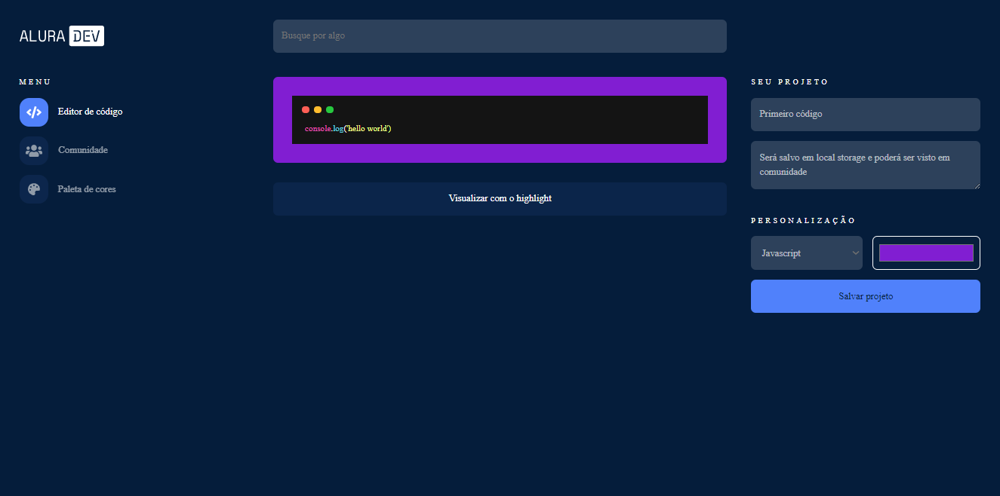

# Alura Challenge Front-end - Editor de código (Vanilla)

#alurachallengefront2

Read this in [english](./README.en.md)

** Estou passando esse código para React usando Nextjs [neste outro repositório](https://github.com/daniel-ben/code-editor) **

Site criado durante o Alura Challenge 2 de Front-end da Alura. O desafio tem como objetivo simular uma situação de trabalho real, onde o usuário deve criar um site para um cliente seguindo um pedido. 

Foi fornecido um template no [figma](https://www.figma.com/file/Ve4hpTfmMa7yAFneoGtGKD/Alura-Challenge---Edição-Front-end?node-id=207%3A1446) para usarmos como base e cards no Trello para nos orientar.

## Projeto no seu habitat natural
- Clique aqui: [Editor de código](https://daniel-ben.github.io/alura-challenge-2/)

## Sumário

- [Objetivos](https://github.com/daniel-ben/alura-challenge-2#objetivos)

- [Como utilizar](https://github.com/daniel-ben/alura-challenge-2#como-utilizar)

- [Screenshots](https://github.com/daniel-ben/alura-challenge-2#screenshots)

- [Construido com](https://github.com/daniel-ben/alura-challenge-2#construido-com)

- [Jornada](https://github.com/daniel-ben/alura-challenge-2#jornada)

- [Em breve](https://github.com/daniel-ben/alura-challenge-2#em-breve)

## Objetivos

- Criar um site do zero a partir de um template
- Usar quaisquer ferramentas para criar o site
- Visualizar códigos com highlight
- Salvar código em extensões png, jpeg ou svg
- Visualizar códigos salvos na página de comunidade
- Códigos editáveis depois de salvos
- Códigos permanecem salvos entre seções 
- Página de estilos para alterar as cores do site

## Como utilizar
- Você pode fazer login com seu user do github (github.com/**seu-username**)
- Se não tiver uma conta no github, basta clicar no botão *entrar sem login*
- Na página de edição, você pode colocar seus códigos e visualiza-los com highlight clicando no botão *Visualizar com o highlight*
- Se quiser salvar o código, basta preencher os campos e clicar no botão *Salvar projeto*
- Para visualizar seus projetos salvos, basta clicar em *comunidade*
- Se quiser editar algum de seus códigos salvos, basta clicar nele dentro da comunidade e o site te levará ao editor
- Você também pode editar as cores do site na página de *paleta de cores*. As mudanças ficarão salvas no local storage

## Screenshots

## Construido com 
- HTML
- CSS
- BEM (Block, Element, Modifier)
- Javascript
- Flexbox 
- Grid Layout
- DatoCMS (BD)

## Jornada

Essa foi minha primeira vez construindo um site todo do zero. Eu aprendi:
- Utilizar bibliotecas como:
  - Highlight JS
- Pegar dados de um BD como o DatoCMS
- Salvar dados no local storage e no session storage
- Estruturar os arquivos do site (e como é difícil organizar tudo)
- Variáveis CSS e como elas ajudam na manutenção
- Conversão de hex para rgb e vice-versa

## Em breve 
** Novas funções sendo adicionadas no [novo repositório](https://github.com/daniel-ben/code-editor) **

Pretendo adicionar mais algumas funcionalidades, como:
- Opção de exportar o código como png, jpeg ou svg
- Opção de mudar o estilo do highlight
- Salvar e editar dados do Banco de Dados e não do local storage
- Comunidade funcional com o código de outras pessoas
- Página do usuário com os códigos feitos apenas pelo usuário.
- Opção de deletar seus códigos
- Barra de pesquisa funcional
- Comentários
